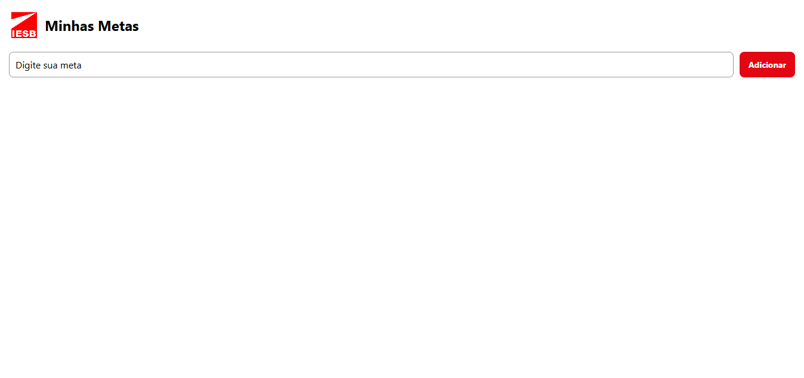
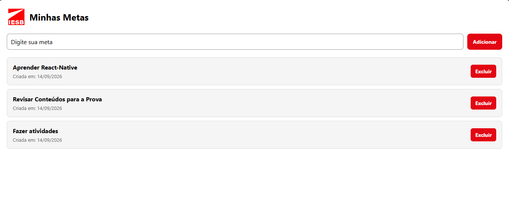
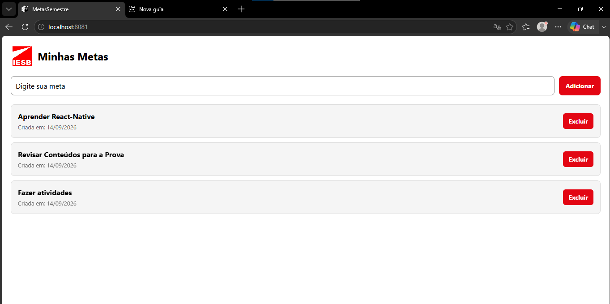
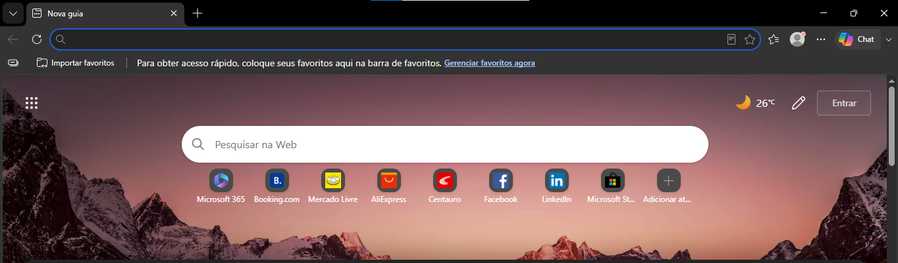
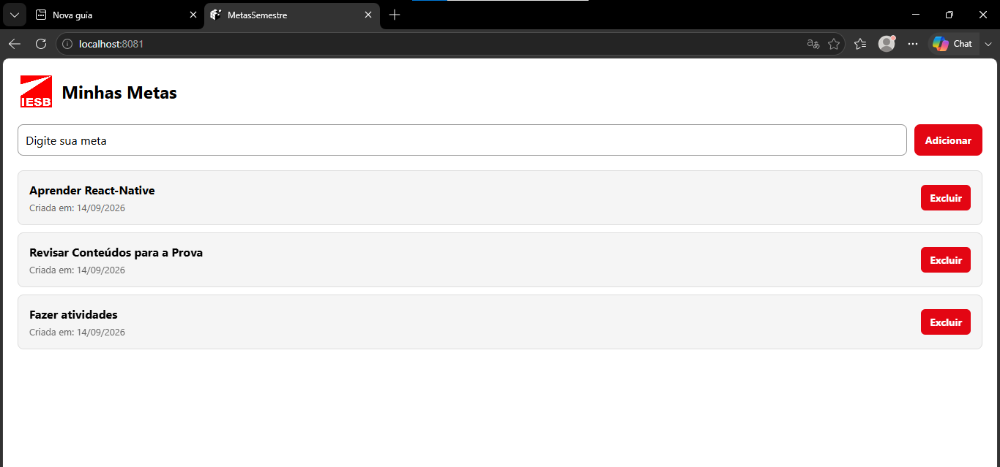

# Minhas Metas

## Descrição

Aplicativo desenvolvido em React Native com Expo para cadastro e gerenciamento de metas do semestre.

O aplicativo permite adicionar metas, visualizar as metas cadastradas e excluir metas. As informações são armazenadas localmente utilizando o AsyncStorage, permitindo que as metas continuem disponíveis mesmo após fechar e abrir o aplicativo novamente.

## Funcionalidades

- Adicionar novas metas.
- Impedir o cadastro de metas vazias.
- Exibir uma mensagem de alerta quando o campo estiver vazio.
- Excluir metas cadastradas.
- Exibir a data de criação de cada meta.
- Armazenar as metas utilizando AsyncStorage.
- Carregar automaticamente as metas salvas ao iniciar o aplicativo.
- Salvar automaticamente as alterações realizadas na lista.

## Tecnologias utilizadas

- React Native
- Expo
- JavaScript
- AsyncStorage
- React Native Safe Area Context

## Estrutura do projeto

```text
MeuDiarioAcademico/
│
├── assets/
│   └── imagem utilizada no cabeçalho
│
├── components/
│   ├── MetaInput.js
│   └── MetaList.js
│
├── App.js
├── package.json
└── README.md

### Adicionar meta

```md
## Como funciona

### Adicionar uma meta

Para adicionar uma meta, o usuário digita o texto no campo de entrada e pressiona o botão "Adicionar".

Antes de cadastrar a meta, o aplicativo verifica se o campo está vazio. Caso esteja, é exibido um Alert informando que o campo não pode estar vazio.

Quando uma meta válida é adicionada, é criado um objeto contendo:

- `id`: identificador único da meta;
- `texto`: texto digitado pelo usuário;
- `criadaEm`: data em que a meta foi criada.

const novaMeta = {
  id: Date.now().toString(),
  texto: texto,
  criadaEm: new Date().toLocaleDateString()
};

### Excluir uma meta

Cada meta possui um botão "Excluir".

Ao pressionar o botão, o aplicativo utiliza o método `filter()` para criar uma nova lista contendo apenas as metas que possuem um `id` diferente do `id` selecionado.

Dessa forma, somente a meta escolhida é removida da lista.

setMeta(meta.filter(meta => meta.id !== id));

### Persistência com AsyncStorage

O aplicativo utiliza o AsyncStorage para armazenar as metas localmente no dispositivo.

Foi utilizada a chave:

`@metas_semestre`

As informações são convertidas para JSON antes de serem armazenadas utilizando `JSON.stringify()` e convertidas novamente para um array utilizando `JSON.parse()` quando são carregadas.

### Carregamento das metas

Um `useEffect` é executado quando o aplicativo é iniciado para verificar se existem metas armazenadas no AsyncStorage.

O método `AsyncStorage.getItem()` busca os dados utilizando a chave `@metas_semestre`.

Caso existam dados salvos, eles são convertidos de JSON para JavaScript utilizando `JSON.parse()` e armazenados no estado da aplicação.

Esse `useEffect` possui um array de dependências vazio (`[]`), fazendo com que o carregamento seja realizado somente na montagem do componente.

O processo também utiliza `try/catch` para tratar possíveis erros e apresentar uma mensagem amigável ao usuário.

### Salvamento das metas

Um segundo `useEffect` é responsável por salvar as metas no AsyncStorage sempre que a lista de metas é alterada.

As metas são convertidas para JSON utilizando `JSON.stringify()` e armazenadas com `AsyncStorage.setItem()` utilizando a chave `@metas_semestre`.

Esse `useEffect` possui `meta` como dependência:

`[meta]`

Assim, sempre que uma meta é adicionada ou excluída, o armazenamento local é atualizado.

O processo também utiliza `try/catch` para tratar possíveis erros durante o salvamento.

## Evidências do funcionamento

### 1. Aplicativo vazio

A imagem abaixo apresenta o aplicativo antes do cadastro de qualquer meta.



### 2. Aplicativo com metas cadastradas

A imagem abaixo apresenta o aplicativo com metas cadastradas. Cada meta apresenta seu texto, a data de criação e o botão para exclusão.



### 3. Metas após fechar e abrir novamente

Após fechar e abrir novamente o aplicativo, as metas permanecem disponíveis. Isso demonstra o funcionamento da persistência utilizando AsyncStorage.



