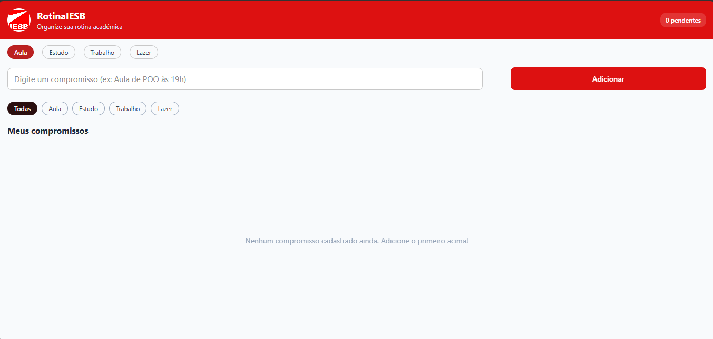
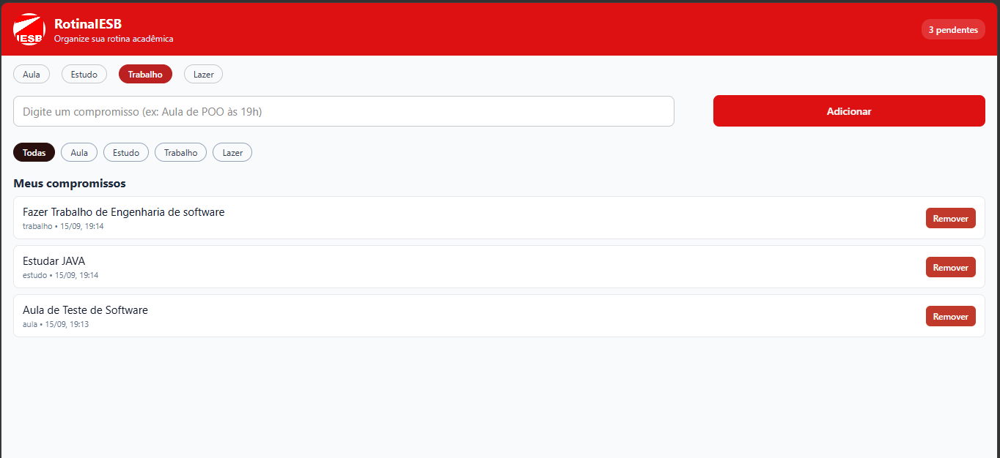
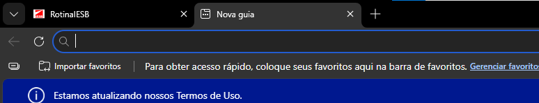
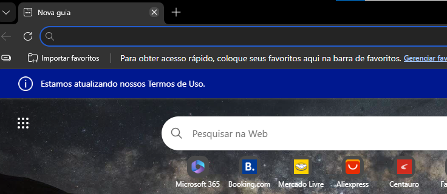
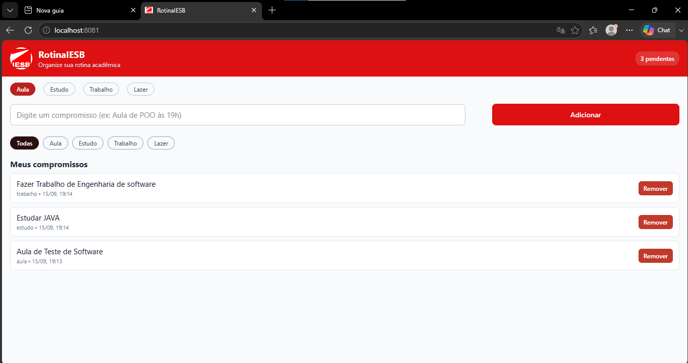

# RotinaIESB

App organizador da rotina acadêmica do aluno no IESB — Atividade Integradora
(Programação para Dispositivos Móveis / React Native / Expo).

## 1) Comando usado para criar o projeto

```bash
npx create-expo-app@latest RotinaIESB --template blank
cd RotinaIESB
npx expo install @react-native-async-storage/async-storage react-native-safe-area-context
```

## 2) Como rodar

```bash
npm install
npx expo start ou npx expo start --web
```

Abra no Expo Go (Android/iOS) ou em um emulador.

## 3) Prints

> Adicione aqui os três prints pedidos pelo enunciado antes de entregar o PR:







## 4) Mapa do useEffect de carga e de salvamento

Ambos estão em `App.js`:

- **Carregamento (montagem)** — `useEffect(() => { ... }, [])`, logo no topo
  do componente `App`. Lê `@rotina_iesb_compromissos` do `AsyncStorage`,
  faz `JSON.parse` e popula o estado `compromissos`. Ao final, marca
  `carregado = true`.
- **Salvamento (dependência da lista)** — `useEffect(() => { ... },
  [compromissos, carregado])`, logo abaixo do primeiro. Sempre que
  `compromissos` muda (adicionar, remover, concluir), faz `JSON.stringify`
  e grava no `AsyncStorage` na mesma chave. Só executa depois que o
  carregamento inicial terminou (`carregado`), para não sobrescrever os
  dados salvos com uma lista vazia antes da leitura.

## 5) Arquivos criados

- `labels.js` — rótulos/textos do app (export nomeado).
- `components/CompromissoInput.js` — campo de texto, seletor de categoria
  e botão de adicionar (recebe `value`, `onChangeText`, `onAdd`, `labels`,
  `categoriaSelecionada`, `onSelecionarCategoria` via props).
- `components/CompromissoList.js` — lista com `FlatList`, remoção
  (`Pressable` + `filter`) e marcação de concluído.
- `App.js` — tela principal: cabeçalho, formulário, filtro por categoria,
  lista, estado (`useState`) e persistência (`useEffect` + `AsyncStorage`).
- `assets/logo.png` — imagem local usada no cabeçalho.

## 6) Estrutura do projeto

```
RotinaIESB/
  App.js
  labels.js
  assets/
    logo.png
  components/
    CompromissoInput.js
    CompromissoList.js
  package.json
  app.json
  README.md
```

## 7) Conteúdos aplicados por aula

| Aula | O que aparece no código |
|------|--------------------------|
| 02 | Projeto Expo (template blank), `App.js`, `app.json`, `package.json`, `assets/` |
| 03 | `labels.js` com export nomeado; `View`, `Text`, `TextInput`, `Image`; `StyleSheet.create` |
| 04 | `flexDirection: 'row'`/`'column'`, `flex`, larguras em `%`, `justifyContent`/`alignItems` |
| 05 | `useState` (texto + lista), props entre `App.js` e os componentes, pasta `components/` |
| 06 | ids únicos (`Date.now().toString()`), remoção com `.filter`, `Pressable` + `android_ripple`, `SafeAreaProvider`/`SafeAreaView`, `useEffect` + `AsyncStorage` + JSON |


